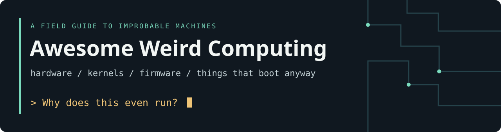
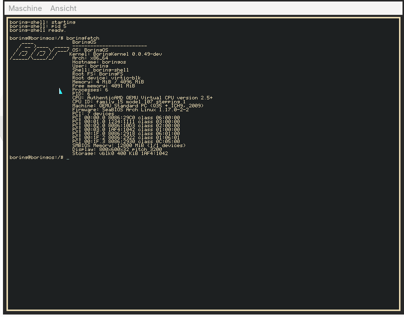
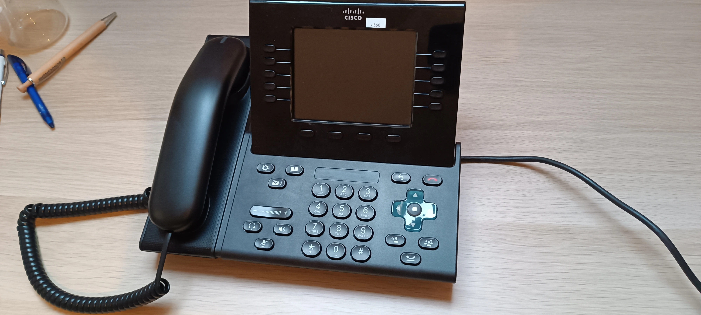

# Awesome Weird Computing

A curated collection of weird hardware, low-level systems, operating systems,
reverse engineering, retro computing and experiments that make you ask:
**“Why does this even run?”**

Follow a boot sequence. Decode an undocumented device. Build a filesystem.
Make an office phone do something its product manager never approved.
The interesting part is finding out how.

> **No link dumping. Every entry should either teach something, solve a real
> problem, document unusual hardware, or be technically interesting enough
> to deserve preservation.**

Original sources, useful tools and technical depth come first. Small experiments
sit beside established references when there is something concrete to learn.
Historical artifacts and prototypes are identified in their descriptions.

**114 curated resources · 17 technical sections · Link review: 2026-10-03**

## Contents

- [Build It Yourself](#build-it-yourself)
- [Operating Systems & Kernels](#operating-systems--kernels)
- [Linux on Weird Hardware](#linux-on-weird-hardware)
- [DOOM on Everything](#doom-on-everything)
- [Reverse Engineering](#reverse-engineering)
- [Firmware & Bootloaders](#firmware--bootloaders)
- [Embedded Linux & RTOS](#embedded-linux--rtos)
- [USB, Input & Storage](#usb-input--storage)
- [Filesystems](#filesystems)
- [Graphics, Displays & Audio](#graphics-displays--audio)
- [Networking](#networking)
- [Retro Computing & Emulation](#retro-computing--emulation)
- [Hardware Hacking](#hardware-hacking)
- [Observability & Inspection](#observability--inspection)
- [Compilers & Machine Models](#compilers--machine-models)
- [Books & Technical Archives](#books--technical-archives)
- [Beautifully Unnecessary](#beautifully-unnecessary)
- [From the Lab](#from-the-lab)
- [Contributing](#contributing)
- [Maintenance](#maintenance)
- [License & attribution](#license--attribution)

## Build It Yourself

- [Build Your Own X](https://github.com/codecrafters-io/build-your-own-x) — Implementation guides for interpreters, databases, operating systems and other machinery worth understanding from the inside.
- [Nand2Tetris](https://www.nand2tetris.org/) — Build a computer from logic gates through a virtual machine and compiler, connecting the layers usually hidden by tools.
- [Ben Eater's 8-bit computer](https://eater.net/8bit) — A breadboard computer built module by module, with explanations of clocks, registers, buses and control logic.
- [Writing an OS in Rust](https://os.phil-opp.com/) — A hands-on kernel series covering freestanding code, interrupts, paging and asynchronous execution.
- [Linux From Scratch](https://www.linuxfromscratch.org/lfs/) — Construct a Linux system from source to understand toolchain bootstrapping and the pieces behind a distribution.
- [Crafting Interpreters](https://craftinginterpreters.com/) — Build a tree-walk interpreter and bytecode virtual machine while learning how language runtimes actually execute code.

## Operating Systems & Kernels

- [OSDev Wiki](https://wiki.osdev.org/Expanded_Main_Page) — Community reference for boot protocols, CPU setup, memory management and the many ways early kernels fail.
- [xv6](https://github.com/mit-pdos/xv6-riscv) — MIT's small teaching Unix for RISC-V makes processes, virtual memory and filesystem code approachable.
- [Linux kernel documentation](https://docs.kernel.org/) — The upstream reference for kernel APIs, driver interfaces, subsystems and development practices.
- [seL4 documentation](https://docs.sel4.systems/) — Explore a capability-based microkernel, its verification scope and the practical work of building systems around it.
- [9front](https://9front.org/) — A living Plan 9 descendant for exploring file-oriented interfaces, namespaces and a different approach to distributed systems.
- [BoringOS](https://github.com/dennishilk/boringos) — An experimental x86_64 OS in C with its own kernel, filesystem, userspace and desktop, including physical USB-hardware bring-up.
- [SerenityOS](https://github.com/SerenityOS/serenity) — A from-scratch Unix-like desktop whose kernel, libraries and applications can be studied together.
- [HelenOS](https://www.helenos.org/) — A portable multiserver microkernel OS that exposes how drivers and services can live outside the kernel.

## Linux on Weird Hardware

- [Nura (formerly postmarketOS)](https://nura.eco/) — A Linux distribution and device-porting effort for reusing phones beyond their original Android support lifetime.
- [Asahi Linux documentation](https://asahilinux.org/docs/) — Hardware research and porting documentation for bringing Linux to Apple Silicon systems.
- [OpenWrt](https://github.com/openwrt/openwrt) — Router-focused Linux firmware with board definitions, target support and build machinery for repurposing network appliances.
- [Wii Linux](https://wii-linux.org/) — Linux on the Nintendo Wii, with installation and platform documentation for repurposing a PowerPC game console.
- [Linux on an 8-bit AVR](https://dmitry.gr/?r=05.Projects&proj=07.%20Linux%20on%208bit) — A historical ARM-emulation experiment on an AVR demonstrates how far abstraction can stretch tiny hardware, even when booting takes hours.
- [mini-rv32ima](https://github.com/cnlohr/mini-rv32ima) — A compact RISC-V emulator that can boot Linux and makes the minimum machinery of an emulated system inspectable.

## DOOM on Everything

- [DOOM source release](https://github.com/id-Software/DOOM) — The historical engine source that made decades of ports possible; study the platform boundary before moving it somewhere absurd.
- [Doomgeneric](https://github.com/ozkl/doomgeneric) — A portable DOOM base with a small platform interface for implementing display, timing and input on new targets.
- [Cisco CP-9951 DOOM](https://github.com/dennishilk/cisco9951-doom) — Native ARMv6 DOOM on an IP phone, documenting shell access, framebuffer output, keypad input and offline audio.
- [DoomPDF](https://github.com/ading2210/doompdf) — DOOM inside a PDF through embedded JavaScript, exposing both a document format's programmability and its viewer limitations.
- [DOOM on the RP2040](https://github.com/kilograham/rp2040-doom) — A microcontroller port that tackles tight memory, flash access, video output and audio rather than assuming desktop resources.
- [Freedoom](https://freedoom.github.io/) — Free game data for DOOM-compatible engines, useful when distributing reproducible ports without proprietary IWAD files.

## Reverse Engineering

- [Ghidra](https://github.com/NationalSecurityAgency/ghidra) — A disassembler and decompiler with processor definitions and scripting for reconstructing unfamiliar binaries.
- [radare2](https://github.com/radareorg/radare2) — A scriptable reverse-engineering toolkit for binary inspection, disassembly, debugging and unusual architectures.
- [Cutter](https://cutter.re/) — A graphical reverse-engineering environment built on Rizin, useful for navigating code and cross-references visually.
- [angr](https://angr.io/) — A binary-analysis framework for symbolic execution and reasoning about paths that are difficult to explore manually.
- [Frida](https://frida.re/) — Dynamic instrumentation for observing and changing program behavior when source-level debugging is unavailable.
- [ImHex](https://github.com/WerWolv/ImHex) — A hex editor with a pattern language that turns opaque firmware and file layouts into structured views.
- [Kaitai Struct](https://kaitai.io/) — Describe binary formats declaratively and generate parsers instead of repeatedly hand-decoding offsets and bit fields.

## Firmware & Bootloaders

- [Limine](https://github.com/limine-bootloader/limine) — A multiprotocol bootloader that handles early boot so experimental kernels can start from a documented interface.
- [U-Boot](https://docs.u-boot.org/en/latest/) — Bootloader documentation for board bring-up, device trees, boot flows and recovery on embedded systems.
- [coreboot](https://doc.coreboot.org/) — Open firmware documentation explaining hardware initialization, payloads and the boundaries between firmware stages.
- [SeaBIOS](https://www.seabios.org/) — An open-source legacy BIOS implementation useful for understanding PC firmware and virtual-machine boot behavior.
- [UEFI specifications](https://uefi.org/specifications) — Primary specifications for UEFI interfaces and related firmware standards, rather than folklore about how boot services work.
- [flashrom](https://www.flashrom.org/) — Tools and documentation for identifying, reading and programming flash chips across supported programmers and boards.
- [Binwalk](https://github.com/ReFirmLabs/binwalk) — Firmware signature analysis and extraction for locating embedded filesystems, compressed data and executable payloads.
- [UEFITool](https://github.com/LongSoft/UEFITool) — Inspect UEFI firmware volumes, files and sections as a structured tree instead of a flat binary blob.

## Embedded Linux & RTOS

- [Buildroot](https://buildroot.org/) — Generate a cross-toolchain, kernel, bootloader and root filesystem for a small, purpose-built embedded Linux image.
- [Yocto Project documentation](https://docs.yoctoproject.org/) — Learn recipe-based embedded distribution construction, layer organization and reproducible image customization.
- [BusyBox](https://busybox.net/) — Many Unix utilities in one compact executable, revealing the userspace foundations of constrained Linux appliances.
- [musl](https://musl.libc.org/) — A compact C standard library whose design and source illuminate the boundary between applications and the Linux kernel.
- [Bootlin training materials](https://bootlin.com/docs/) — Freely available slides and labs covering embedded Linux, kernel drivers, device trees and real-time systems.
- [Zephyr](https://docs.zephyrproject.org/latest/) — An RTOS with documented device models, board support and driver APIs for resource-constrained hardware.
- [FreeRTOS Kernel](https://github.com/FreeRTOS/FreeRTOS-Kernel) — A small real-time kernel for studying task scheduling, synchronization and architecture-specific context switching.

## USB, Input & Storage

- [USB specifications](https://www.usb.org/documents) — The USB-IF document library provides original bus and device-class specifications for implementing interoperable devices.
- [libusb](https://libusb.info/) — A portable userspace USB API for talking to devices without first writing a kernel driver.
- [TinyUSB](https://github.com/hathach/tinyusb) — An embedded USB host and device stack with practical examples of descriptors and device classes.
- [Linux HID documentation](https://docs.kernel.org/hid/index.html) — Upstream explanations of HID reports, transport drivers and the machinery behind seemingly simple input devices.
- [Linux USB gadget documentation](https://docs.kernel.org/usb/gadget_configfs.html) — Compose USB device functions through configfs and turn suitable Linux hardware into a configurable USB peripheral.
- [Body2Bits](https://github.com/dennishilk/Body2Bits) — Experimental Linux input projects repurpose Wii Balance Board sensor readings into game controls and physical interactions.
- [sg3_utils](https://doug-gilbert.github.io/sg3_utils.html) — SCSI command-line utilities expose inquiry, sense data and storage behavior beneath ordinary filesystem access.

## Filesystems

- [littlefs](https://github.com/littlefs-project/littlefs) — A small flash filesystem designed around power-loss resilience and the realities of erase blocks and wear.
- [FatFs](https://elm-chan.org/fsw/ff/) — A portable FAT implementation with documentation for bringing removable storage to small embedded systems.
- [Btrfs documentation](https://btrfs.readthedocs.io/en/latest/) — Study copy-on-write, checksums, subvolumes and the operational tradeoffs behind a modern Linux filesystem.
- [OpenZFS documentation](https://openzfs.github.io/openzfs-docs/) — Reference material for pooled storage, datasets, integrity checks and recovery-oriented administration.
- [FUSE](https://github.com/libfuse/libfuse) — Build filesystems in userspace and experiment with filesystem semantics without adding code to the kernel.
- [VelociFS](https://github.com/dennishilk/VelociFS) — An experimental Steam-library tuning CLI that makes ext4 and Btrfs tradeoffs visible through inspection, plans and rollback notes.

## Graphics, Displays & Audio

- [Linux DRM/KMS documentation](https://docs.kernel.org/gpu/drm-kms.html) — The upstream guide to display modesetting, planes, CRTCs and the objects behind a Linux display pipeline.
- [TinyRenderer](https://github.com/ssloy/tinyrenderer) — Build a small software renderer to understand rasterization, interpolation and shading without a graphics API hiding the work.
- [Project F](https://projectf.io/) — FPGA tutorials and source examples for display timing, graphics and the digital logic behind pixels.
- [The Book of Shaders](https://thebookofshaders.com/) — Interactive explanations of fragment shaders, coordinate systems, procedural patterns and graphics mathematics.
- [BoringWM](https://github.com/dennishilk/boringwm) — A small Rust X11 window manager with explicit state and documented limitations, useful for studying window lifecycle and tiling.
- [SPDIF Fix](https://github.com/dennishilk/spdif-fix) — A Linux audio workaround documenting keepalive approaches to delayed receiver wake-up across PulseAudio, PipeWire and ALSA.

## Networking

- [Wireshark User's Guide](https://www.wireshark.org/docs/wsug_html_chunked/) — Learn packet capture, filtering and protocol dissection while keeping the actual traffic available for inspection.
- [Beej's Guide to Network Programming](https://beej.us/guide/bgnet/) — A practical sockets guide that connects TCP and UDP concepts to working C programs.
- [lwIP](https://www.nongnu.org/lwip/2_1_x/index.html) — A lightweight TCP/IP stack for understanding networking under embedded memory and scheduling constraints.
- [Scapy](https://scapy.readthedocs.io/en/latest/) — Construct, decode and inspect packets interactively when a normal socket API hides the fields you need to study.
- [RFC Editor](https://www.rfc-editor.org/) — The authoritative RFC archive for tracing Internet protocols back to their specifications and design rationale.
- [Open OSCAR Server](https://github.com/mk6i/open-oscar-server) — An OSCAR server implementation that reconnects old AIM and ICQ clients and documents a once-proprietary messaging protocol.

## Retro Computing & Emulation

- [FreeDOS](https://www.freedos.org/) — A free DOS-compatible operating system for maintaining old software and exploring the real-mode PC environment.
- [DOSBox-X](https://dosbox-x.com/) — A DOS-focused emulator with extensive hardware configuration for software that depends on particular historical PC behavior.
- [MAME](https://www.mamedev.org/) — Hardware emulation as preservation, with source that documents arcade machines and many other historical systems.
- [QEMU](https://www.qemu.org/docs/master/) — System and user-mode emulation documentation for running foreign architectures and testing low-level software.
- [Bochs](https://bochs.sourceforge.io/) — An x86 PC emulator with debugging facilities suited to observing boot code, CPU state and early kernel faults.
- [Renode](https://renode.readthedocs.io/en/latest/) — Model and test embedded systems with peripheral simulation, scripted scenarios and multi-node setups.
- [SIMH](https://github.com/simh/simh) — Simulators for historical computers preserve the behavior of machines whose original hardware is increasingly difficult to maintain.
- [86Box](https://86box.net/) — Detailed emulation of historical x86 machines for studying old chipsets, expansion cards and operating-system expectations.
- [A working Windows 98 lab](https://www.dennishilk.com/museum/home-computing-lab/retro-pc/) — A photographed first-party record of a real retro workstation, its role in the lab and continued network use.

## Hardware Hacking

- [OpenOCD](https://openocd.org/) — On-chip debugging through JTAG and SWD, with documentation for connecting debuggers to real target hardware.
- [sigrok](https://sigrok.org/) — An open signal-analysis stack with protocol decoders for turning logic-analyzer traces into bus transactions.
- [Glasgow Interface Explorer](https://github.com/GlasgowEmbedded/glasgow) — A programmable hardware interface tool that bridges unusual buses and helps interrogate undocumented electronics.
- [ChipWhisperer](https://github.com/newaetech/chipwhisperer) — Open hardware, software and teaching material for power analysis and fault-injection experiments.
- [KiCad](https://docs.kicad.org/) — Official documentation for moving from a circuit idea to schematics, PCB layout and manufacturing outputs.
- [Project IceStorm](https://github.com/YosysHQ/icestorm) — Reverse-engineered iCE40 FPGA bitstream documentation and tools that helped make an open FPGA toolchain possible.
- [The missing capacitor](https://www.dennishilk.com/museum/home-computing-lab/field-notes/field-note-3/) — A photographed motherboard-damage field note preserves what happened and what kept working, without presenting survival as a recommended repair.

## Observability & Inspection

- [bpftrace](https://bpftrace.org/) — A high-level tracing language for investigating kernel and userspace behavior through eBPF instrumentation.
- [strace](https://strace.io/) — Observe system calls and signals to learn what a program actually asks the operating system to do.
- [rr](https://rr-project.org/) — Record and replay program execution to revisit intermittent failures with a debugger.
- [Brendan Gregg's performance tools](https://www.brendangregg.com/linuxperf.html) — A systems-oriented map of Linux performance tools that helps choose measurements before guessing at a bottleneck.
- [World Observer](https://github.com/dennishilk/world-observer) — An experimental public-data observability pipeline that preserves dated measurements and exports small static dashboards.
- [Windows Telemetry Inspector](https://github.com/dennishilk/windows-telemetry-inspector) — A passive ETW-based network inspector that correlates Windows activity with processes and preserves captures for later review.
- [BYO — Before You Open](https://github.com/dennishilk/byo) — A pre-alpha offline inspector for file headers, URLs and QR payloads that reports observations without claiming an input is safe.
- [Failure Lab](https://www.dennishilk.com/museum/failure-lab/) — A browser-only educational simulation for exploring Linux failure scenarios; it does not execute a real kernel or shell.

## Compilers & Machine Models

- [LLVM tutorials](https://llvm.org/docs/tutorial/) — Build a small language frontend and learn how parsing, intermediate representation and code generation fit together.
- [GCC internals](https://gcc.gnu.org/onlinedocs/gccint/) — The compiler's own guide to intermediate representations, target descriptions and backend implementation.
- [RISC-V specifications](https://riscv.org/specifications/ratified/) — Primary architecture specifications for implementing or studying open instruction sets and privileged machine behavior.
- [Compiler Explorer](https://godbolt.org/) — Compare generated assembly across compilers and architectures to connect source-level choices to machine instructions.
- [Yosys](https://yosyshq.net/yosys/) — An open synthesis framework for inspecting how hardware descriptions become digital logic.

## Books & Technical Archives

- [Operating Systems: Three Easy Pieces](https://pages.cs.wisc.edu/~remzi/OSTEP/) — A freely available textbook organized around virtualization, concurrency and persistence, with exercises and practical projects.
- [The Architecture of Open Source Applications](https://aosabook.org/en/) — System authors explain implementation decisions and tradeoffs in substantial open-source software.
- [Game Engine Black Book: DOOM](https://fabiensanglard.net/gebbdoom/) — A detailed study of DOOM's engine and contemporary hardware constraints, connecting rendering tricks to machine capabilities.
- [Bitsavers](https://bitsavers.org/) — A preservation archive of manuals, schematics and software for hardware that often has no surviving modern documentation.
- [The Unix Heritage Society](https://www.tuhs.org/) — Historical Unix source and discussion archives preserve the evolution of interfaces still shaping today's systems.
- [Xerox Alto source archive](https://xeroxparcarchive.computerhistory.org/Xerox_PARC_source_code.html) — A historical source archive from Xerox PARC, preserving operating systems, applications and tools from the Alto era.
- [NESdev Wiki](https://www.nesdev.org/wiki/Nesdev_Wiki) — Community hardware research documenting the NES CPU, PPU, cartridge mappers and timing behavior.

## Beautifully Unnecessary

- [C64 OS programming guide](https://c64os.com/c64os/programmersguide/) — Programming documentation for a commercial Commodore 64 operating environment, exposing how applications fit within an 8-bit machine.
- [EmuTOS](https://emutos.sourceforge.io/) — A free Atari TOS replacement that keeps an old machine family useful while exposing its operating-system interfaces.
- [Collapse OS](https://collapseos.org/) — A deliberately constrained Forth-based system exploring how computers might bootstrap software with scavenged hardware.
- [8088 MPH technical breakdown](https://www.reenigne.org/blog/more-8088-mph-how-its-done/) — A demo author explains the timing and CGA tricks behind a historical IBM PC demo, with links to implementation details.
- [Onramp](https://github.com/ludocode/onramp) — An experimental, incomplete C toolchain that bootstraps itself through small, documented stages from a tiny virtual machine.

## From the Lab

Some entries come from Dennis Hilk's own work and are listed in their technical
sections under the same selection criteria as everything else. These two small
artifacts show the kind of investigation behind the collection.

<table>
  <tr>
    <td width="50%"></td>
    <td width="50%"></td>
  </tr>
  <tr>
    <td><strong>A kernel of one's own.</strong> An early BoringOS QEMU screenshot; the repository documents subsequent hardware and desktop work.</td>
    <td><strong>An office phone with other plans.</strong> The actual Cisco CP-9951 from the native DOOM project; this is the powered-off test setup, not a gameplay screenshot.</td>
  </tr>
</table>

## Contributing

Found something with a good explanation, a strange architecture or an ingenious
implementation? Read [CONTRIBUTING.md](CONTRIBUTING.md), then suggest one focused
addition with a sentence explaining its technical value. Corrections and better
primary sources are equally welcome. Self-promotion gets the same scrutiny as
any other submission.

## Maintenance

This is a collection to revisit, not a race to accumulate links. Reviews check
both reachability and whether the destination still delivers the described
material. A successful HTTP response alone does not qualify a resource.

Prefer stable upstream URLs, follow project renames, remove duplicate mirrors and
replace shallow or obsolete resources with stronger ones. Preserve historical
work when its design, evidence or documentation remains valuable, and label it
accordingly. Review links when editing a section and periodically across the
whole collection; the date above records the latest complete pass, not a promise
of continuous monitoring.

The count covers only the described entries in the 17 technical sections;
navigation, image credits and repository housekeeping links do not count.
Related references within a documentation set cover distinct subsystems rather
than repeating the same landing page. Inclusion is an invitation to inspect a
resource, not a claim that every linked tool is production-ready.

## License & attribution

The collection text and original banner use the [MIT license](LICENSE). Linked
projects, specifications, books and archives keep their own licenses and access
terms; a public source archive is not automatically open-source software.
First-party photographs and screenshots are credited in
[assets/README.md](assets/README.md). No third-party project imagery is copied here.
